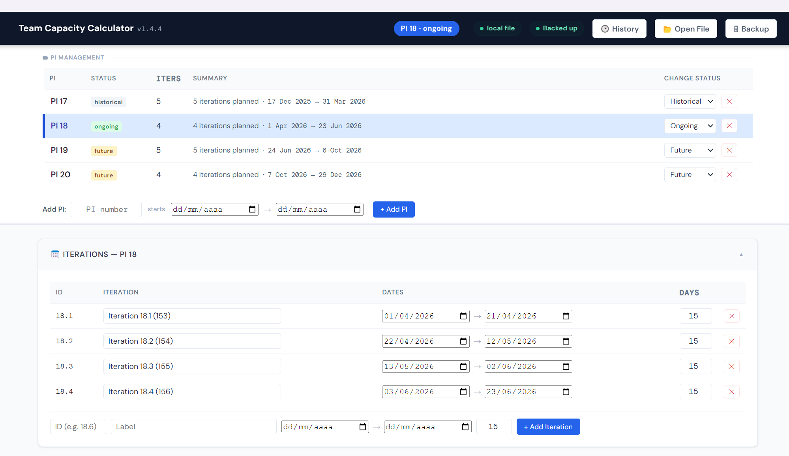
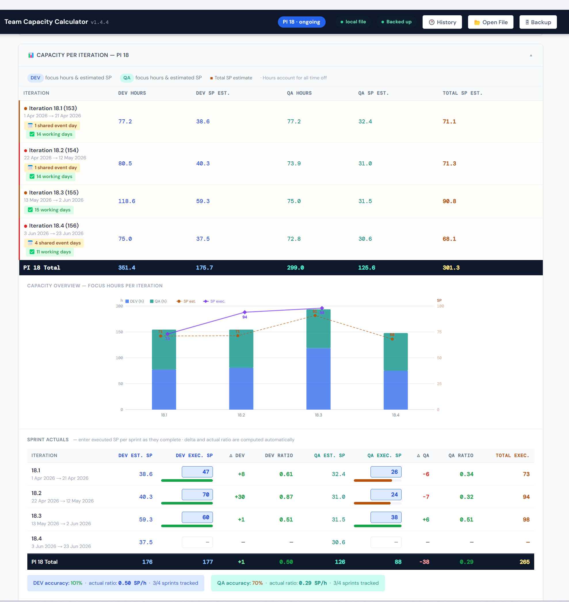
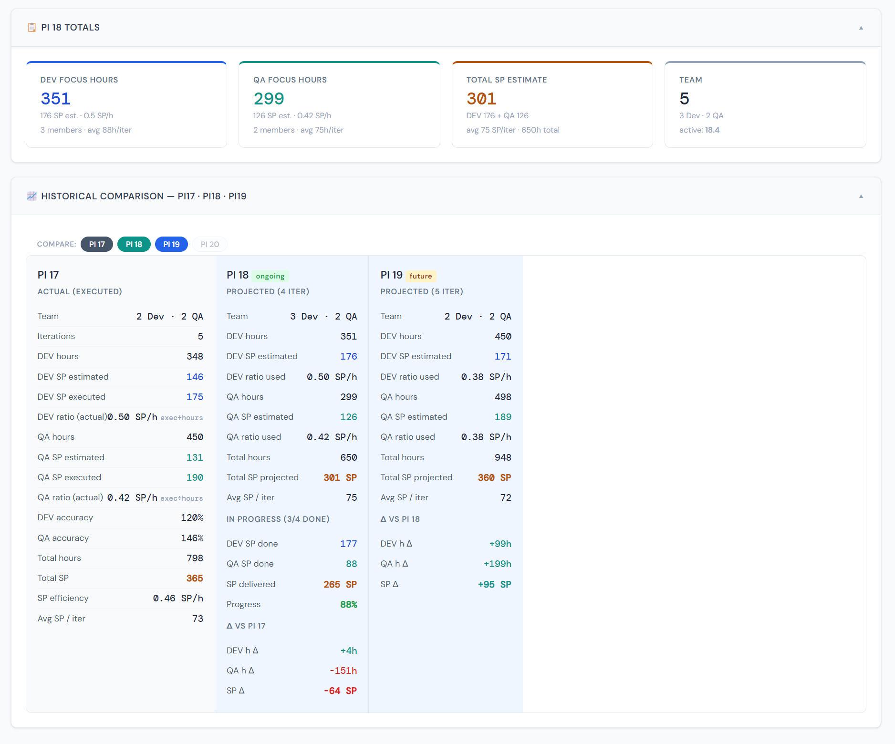

# Team Capacity Calculator

Desktop app (Windows) for planning team capacity per PI/sprint — focus hours, leave, overhead/ceremonies, and estimated Story Points per iteration.

## How to get the app

Go to [Releases](../../releases) and download the latest `.exe` (e.g. `Team Capacity Calculator x.y.z.exe`). No installation needed — it's portable, just run the file.

> **Note:** the `.exe` isn't digitally signed. Windows will show a "Windows protected your PC" / SmartScreen warning on first run. Click **"More info"** → **"Run anyway"**. This only happens once per machine.

On first launch, the app shows a **"Connect a data file"** banner — what to do next depends on who you are.

---

## Screenshots

**PI management** — add/track Program Increments and their iterations, switch which one is active.

**Capacity per iteration** — focus hours, estimated Story Points, and a chart comparing estimated vs. executed SP across the PI.

**PI totals & historical comparison** — side-by-side comparison across PIs, with deltas and accuracy vs. previous PIs.

---

## 👤 I'm from a different team, starting from scratch

If you don't have any data yet and you're going to use this app for your own team:

1. On the initial banner, choose **"Create new file"**.
2. Pick a location **on your own computer** to save the data file — this will be your primary file.
3. The app starts empty. You'll want to set up: your team (Section 1 → Team), overhead/ceremonies, your team's PIs and iterations, etc.
4. Optionally, use the **"🗄 Backup"** button at the top to set up a safety mirror on the network drive — e.g. `\\10.135.2.100\<YourTeamFolder>\...` (use your own team's folder, not another team's). This is entirely independent of everything else.

⚠️ **Important:** don't choose "Open existing file" pointing at another team's file (e.g. the SysMgm team's backup) — that would load *their* data, not yours. Always start with **"Create new file"**.

---

## 👤 I'm from the SysMgm team and want the team's current data

If you're joining the SysMgm team and want to continue from the data that already exists (PIs, team, history):

1. Contact the project admin (**pij4ovr**) and ask for the shared team backup file's location.
2. Copy that file to a local folder on your computer.
3. Open the app → on the initial banner, choose **"Open existing file"** → select the local copy you just made. This becomes your primary (local) file.
4. Click **"🗄 Backup"** at the top and point it at the **same** network location the admin gave you. From then on, the app stays automatically in sync with the rest of the team through that shared file — no need to manually copy anything again.

---

## More information

- Architecture and technical details: [ARCHITECTURE.md](ARCHITECTURE.md) and [CONTEXT.md](CONTEXT.md).
- To run from source (development), see the "Desktop App Files & Build" section in `CONTEXT.md`.
